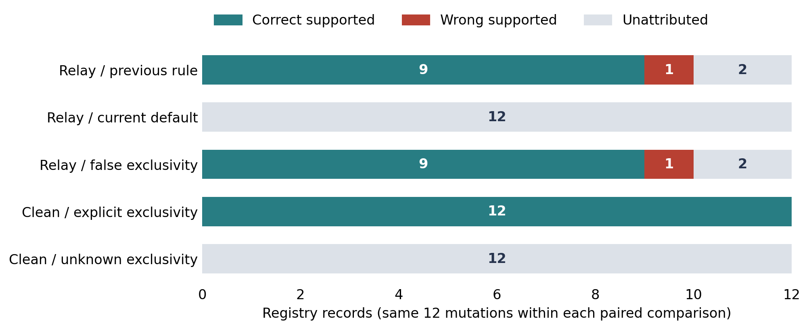

# Receipt possession is not event attribution

**Status:** AI-assisted draft prepared for the author's review before submission.

**Author:** Ryan Junejo

**Affiliation:** CrashLabs

## Abstract

Agent-incident reconstruction can mistake a copied receipt for proof that a particular tool event caused a write. We reproduced this failure in EvidenceGraph. Copying a genuine receipt, token included, into another native transcript produced one wrong supported attribution among twelve registry mutations. We changed the rule so that matching tokens stay ambiguous unless the case declares recorder authenticity or token exclusivity. Twelve paired evidence conditions across three scripted seeds gave the specified outcome in all 36 checks, including a deliberately false declaration that still misattributes. The safer default has a cost. On clean evidence with unknown token exclusivity it withholds all twelve correct attributions. The artifact includes native logs, separate dispatch-based scoring truth, cited dockets, verified bundles and an evidence-collection checklist. These are development checks on a small synthetic workflow. They do not estimate operational accuracy or investigator usefulness.

## 1. Introduction

Incident reconstruction must separate two questions: did an action happen, and which recorded event performed it. Hugging Face's technical account describes correlating recovered agent logs with its own platform records [1]. Cross-source checking is the right instinct. A transcript entry that matches a platform record still may not be the event that caused it.

This Track 1 project addresses the sprint's fabricated-evidence direction [2]. We use EvidenceGraph to test one narrow failure: a transcript event carries a genuine receipt copied from another event. We contribute an executed counterexample, a safer attribution default, and a reproducible evidence-sufficiency pack. Receipt replay is not a new security discovery, and we do not claim this patch would have prevented the Hugging Face intrusion.

## 2. Related Work

EvidenceGraph already preserved source bytes, ingested native Inspect logs, reconciled registry records, and produced cited dockets and portable bundles [3]. It reuses Crossledger code, listed in the repository's reuse inventory [4]. Those capabilities and the existing public-wiki audit predate this extension.

Inspect's viewer browses logs, and Inspect Scout runs transcript-analysis workflows [5, 6]. This experiment adds cross-source attribution checks; it does not evaluate either tool's investigator performance. CoSAI's incident-response framework covers collecting AI telemetry [7]. Our checklist names the evidence this one inference needs. The baselines are an ablated rule and a scripted positive control. We did not compare against any state-of-the-art forensic system.

## 3. Methods

Each seed stages twelve accepted registry mutations under four scripted labels. Native Inspect containers record the tool calls. A separate host log binds each mutation to an event UUID and is used only for scoring. The runs use no model, external target or production credential. Public evidence excludes the private bindings.

From each seed we generate paired views: invented receipts, missing transcripts, copied public receipts, full-token relays, missing tokens, unknown clocks, dependent witnesses and incomplete capture. The relay reads A's public transcript, copies its complete receipt into a new B event, and withholds A. The false-exclusivity control uses the same bytes but declares that tokens could not have been copied. A clean pair measures what leaving that declaration unset costs.

We pad normal capture windows by 0.1 seconds and declare a 0.05-second clock bound. A boundary case contains every real mutation but ends before the added claims' widened execution windows. The analyzer contradicts a missing write only when independent, complete capture covers its whole possible execution window.

The old-rule ablation grants token exclusivity implicitly while keeping the other rules. A separate claim-only control accepts every well-formed successful receipt. An attribution counts as correct only if it names the event UUID in the private dispatch log. Fabricated-claim detection is scored separately, against the injected claims rather than the registry records. Seeds 0 to 2 change payloads; labels, action structure and transforms stay fixed. We designed this test after observing the counterexample. It has no held-out data and no significance testing.

## 4. Results

Before the change, the probe supported ten attributions: nine correct and one assigned to the copied event. After the change, the full-relay view has ten ambiguous and two unmatched records and no supported attribution. A deliberately false exclusivity declaration brings the wrong attribution back. Figure 1 shows both effects. The wrong attribution disappears, and so do the correct ones whenever nobody can declare exclusivity.



*Figure 1. First-seed results; all three seeds give the same counts. Every bar describes twelve registry mutations. The three relay rows share one evidence set, and the two clean rows share another. “Unattributed” includes ambiguous and unmatched records. These are paired software conditions, not independent incidents.*

With token exclusivity declared, clean evidence supports all twelve writes. With A withheld, nine stay supported and three are unmatched. Two invented receipts are contradicted under complete independent capture. They stay unresolved when capture is incomplete, dependent, or ends too early. A public receipt copied without its token stays ambiguous.

All 36 condition-by-seed checks gave the specified outcome. No genuine event was accused of being fabricated. Each of the three false-declaration conditions contains one wrong supported attribution, which is the expected result of that control. Three representative bundles passed integrity checks and graph-to-docket recomputation. Full per-condition results and exact source identities accompany the artifact [8].

## 5. Discussion and Limitations

A token hash proves possession of a receipt. Attributing the write to an event needs one more collection assumption. Declaring that assumption keeps a known limitation from appearing in the docket as unconditional support. The cost shows in the clean row: with exclusivity unknown, zero of twelve correct attributions are supported. The change makes the failure visible; it does not solve the task.

The evaluator and analyzer live in the same project, and all cases share one small scripted structure. We did not measure real model behavior, responder time, field accuracy, a compromised collector, or performance at volume. Caller labels do not authenticate agents. Hashes do not show that source records were truthful, and a false authenticity or exclusivity declaration can still mislead the tool.

The next step is one consented corpus with independently adjudicated event bindings, followed by a frozen, counterbalanced comparison of investigators using the graph against investigators using ordinary logs and scripts. Wrong supported conclusions, justified abstentions and investigation time should decide whether the graph earns its maintenance cost.

## 6. Conclusion

One copied receipt was enough to make the prototype attribute a real write to the wrong event. Requiring an explicit exclusivity or authenticity declaration removes that error in every tested case, and withholds correct attributions whenever nobody can make the declaration. Whether investigators gain anything from the graph in practice is untested.

## Code and Data

- Code repository (baseline before this work): [https://github.com/crashlabsai/evidencegraph](https://github.com/crashlabsai/evidencegraph)
- Sprint extension, results, protocol and checklist: held by the author pending disclosure review; available on request.
- Review pack: source snapshot, native evidence, synthetic private truth, generated cases and representative bundles, held with the extension and available on request.

Reproduce with:

```
uv sync --locked
uv run python scripts/incident_stress.py cases/reproduction --seeds 0 1 2
uv run eg verify cases/reproduction/bundles/0-full_receipt_relay --recompute
```

The generated `RESULTS.md` lists per-condition scores. Decisions and counts should reproduce; UUIDs, timestamps and hashes will differ.

## References

1. Hugging Face (2026). Anatomy of a Frontier Lab Agent Intrusion. Technical incident account. [https://huggingface.co/blog/agent-intrusion-technical-timeline](https://huggingface.co/blog/agent-intrusion-technical-timeline)
2. Apart Research and CeSIA (2026). AI Incident Response Sprint: track descriptions and guidelines. [https://apartresearch.com/sprints/ai-incident-response-sprint-2026-09-11-to-2026-09-13](https://apartresearch.com/sprints/ai-incident-response-sprint-2026-09-11-to-2026-09-13)
3. CrashLabs (2026). EvidenceGraph, starting revision efbd419. Prior implementation and documentation. [https://github.com/crashlabsai/evidencegraph/tree/efbd419](https://github.com/crashlabsai/evidencegraph/tree/efbd419)
4. CrashLabs (2026). EvidenceGraph reused source inventory: Crossledger provenance and adaptation record. [https://github.com/crashlabsai/evidencegraph/blob/main/VENDORED.md](https://github.com/crashlabsai/evidencegraph/blob/main/VENDORED.md)
5. UK AI Security Institute (accessed 2026-09-14). Inspect: Log Viewer. Official documentation. [https://inspect.aisi.org.uk/log-viewer.html](https://inspect.aisi.org.uk/log-viewer.html)
6. Meridian Labs (accessed 2026-09-14). Inspect Scout: Workflow. Official documentation. [https://meridianlabs-ai.github.io/inspect_scout/workflow.html](https://meridianlabs-ai.github.io/inspect_scout/workflow.html)
7. Coalition for Secure AI (2025). Defending AI Systems: A New Framework for Incident Response. [https://www.coalitionforsecureai.org/defending-ai-systems-a-new-framework-for-incident-response-in-the-age-of-intelligent-technology/](https://www.coalitionforsecureai.org/defending-ai-systems-a-new-framework-for-incident-response-in-the-age-of-intelligent-technology/)
8. CrashLabs (2026). Stress results, protocol, pre-change probe and provenance for this report. Unpublished development artifacts, available from the author on request.

## Appendix A. Limitations and Dual-Use Considerations

The fixture edits synthetic logs to test misleading evidence. It contains no exploit, no installation into a third-party system, no production credential, no model-weight transfer and no new containment escape. Copying a receipt is the whole technique. What we release is the test and the conservative interpretation rule.

The private truth never enters an analyzer witness set. It sits in the local research archive so that scoring can be audited; investigators do not receive it as an input. All truth and tokens in that archive are synthetic.

Bundle verification detects changes relative to the included unsigned manifest and checks that the docket follows the included graph. It does not authenticate the collector, and it does not replay every derivation from raw evidence. A complete declared population is itself a collection assumption. No result shows the absence of unobserved actions, persistent models, or malicious intent.

## Appendix B. Evidence Sufficiency and Reuse

The accompanying checklist pairs nine collection questions with sufficient and insufficient answers. Each question separates observing a mutation from binding it to an event. A second copy of the same receipt, a correct token, or matching clocks does not on its own bind the two. Upgrading the analyzer invalidates old derived conclusions until re-ingestion and recomputation, so legacy supported outputs cannot survive the safer rule unnoticed.

Prior work is EvidenceGraph's existing graph, adapters, registry stage, scoring, wiki audit and export, plus the recorded Crossledger ports. New work is the full-token relay probe, the explicit exclusivity declaration, upgrade invalidation, the stress transformations and controls, the results and this review pack. We do not claim the bearer-token failure as a new vulnerability class.

## LLM Usage Statement

Codex and Claude implemented the extension, ran the experiment and helped write and edit this report. Ryan Junejo directed the work and is responsible for the text. All counts come from the recorded runs in the accompanying artifacts.
