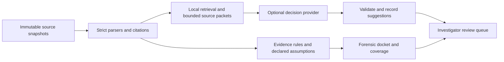

# TypeSafe in EvidenceGraph: assessment and proposed design

Assessment date: 2026-09-21. Code reviewed at
`bf06426ba97cdc3bdbd955928dc445fce5a41c6a`. This was written as a design
recommendation before any integration. The first pilot it recommends (claim
classification and semantic search for LQ5 review, with a provider-neutral run format,
offline replay and a controlled comparison) is now implemented; see
[suggestions.md](suggestions.md) for the design as built and the measured results.

**Recommendation: evaluate Jev as an optional aid to investigation. Keep forensic
decisions grounded in the existing evidence rules.**

TypeSafe could make EvidenceGraph more useful on unfamiliar, verbose transcripts:
find relevant passages, classify what a passage claims, and rank what an investigator
should inspect. Its constrained interface fits these jobs. It cannot establish
whether a recorder was authentic, an observation was independent, a capture was
complete, or a copied receipt identifies its original recipient. Those are precisely
the uncertainties EvidenceGraph must preserve.

The present product is predominantly deterministic, with live scanning disabled.
Adding Jev therefore introduces model errors into a new assistance feature; it does
not remove hallucination from a currently deployed generative decision system. A
rewrite of the reconciler around Jev would weaken the project's central contract.
A focused rewrite of scanner execution, evaluation, and provenance would be useful.

**What TypeSafe actually contributes**

Jev accepts supplied state and bounded questions. Choice selects a category and
returns its distribution; Score returns an expectation over ordered rubric levels;
Noul estimates a binary proposition. This is a useful interface for explicit,
testable policies. It avoids asking a model to invent arbitrary text or identifiers
when the application already knows the permissible answers. See the
[introduction](https://docs.typesafe.ai/introduction) and
[API contract](https://docs.typesafe.ai/api).

That constrains the answer space, not the truth of the answer. Selecting an existing
but wrong event can be more damaging than producing malformed JSON. A fixed choice
also needs ways to express missing information, no suitable candidate, or multiple
suitable candidates. Do not force one explanation when the evidence permits several.

TypeSafe describes its training as reinforcement learning for calibrated decisions.
That is a vendor description of its objective, not evidence of calibration on agent
incident forensics. Even successful calibration describes groups of predictions,
not certainty about one incident. See the
[training primer](https://docs.typesafe.ai/introduction/machine-learning-primer).

Choice/Score confidence summarizes the returned probability distribution; it is not
a separate truth assessor or a forensic confidence interval. Noul has no separate
confidence field. Thresholds must be evaluated per task and version. A confident
`insufficient_context` answer still means abstain. See
[confidence](https://docs.typesafe.ai/confidence).

Questions in a request do not consume each other's answers. Their errors can still
be correlated because they share a model and evidence. Do not multiply outputs as
independent likelihoods, count several answers as several witnesses, or interpret
a weighted priority score as the probability of guilt. Dependencies require code
and, where necessary, another request. See
[state](https://docs.typesafe.ai/concepts/state) and
[composition guidance](https://docs.typesafe.ai/concepts/how-to-build-with-system-one).

The vendor explicitly reports susceptibility to adversarial state, weak arithmetic
and date comparison, difficulty with indirection, and accuracy degradation from
irrelevant context. These limitations fit our threat model unusually closely:
transcripts can contain misleading instructions and fabricated claims. Precise
prompts help define a task; they do not isolate hostile content. See the
[Jev 1.13 limitations](https://docs.typesafe.ai/model-jaggedness/jev-1.13).

**Integration opportunities, in priority order**

These are proposed uses, not capabilities the repository already has. Each model
output below would be an explicitly labeled suggestion with source citations.

| Use | Concrete integration | Benefit and limit | Priority |
|---|---|---|---|
| Semantic evidence search | Retrieve event/message spans locally, then Score relevance to an investigator's question; return existing citation IDs through a local mapping | Helps when wording differs from the query. Show the searched scope and retain ordinary browsing; ranking is not completeness | First pilot |
| Unstructured claim classification | For each enumerated span, Choice among `claims_completed_write`, `plans_write`, `denies_write`, `quotes_other_claim`, `other`, `insufficient_context` | Useful beyond named native tools. A statement of completion remains a statement, including when fabricated | First pilot |
| Span and argument disambiguation | Code extracts possible paths, names, URLs, or dates; Choice selects a supplied candidate or abstains | Prevents invented strings. Candidate generation can omit the correct value; preserve offsets and validate normalization locally | Next |
| Review prioritization | Score relevance or review urgency for unresolved records under LQ1/LQ5/DQ8 | Can save investigator time. Never hide the remaining queue or convert urgency into evidential support | Next |
| Claim versus passage checking | Choice classifies whether a supplied passage asserts, denies, merely mentions, or does not address a claim | Helps review investigator notes and future narrative drafts. A source asserting something does not establish its truth | Next |
| Read-only question routing | Map natural-language requests onto the sixteen frozen questions or allowlisted query templates, with `unsupported_request` | Makes existing answers easier to find. Code validates arguments and permissions; no generated SQL or shell commands required | Next |
| Artifact/page family suggestions | Judge semantic relatedness of a locally retrieved pair for DQ3/DQ6/LQ4 | Finds paraphrases beyond hashes. Do not replace publisher family labels or reuse their `family_confidence` as a model threshold | Conditional |
| Semantic version comparison | Classify a verified pair of artifact texts as likely equivalent, materially changed, or unclear | Useful review annotation beside exact hashes and diff ancestry. Similarity establishes neither copying nor direction | Conditional |
| Tool-output disagreement triage | Suggest whether differing outputs may reflect formatting, truncation, or substantive disagreement | Useful beside `reconcile/consistency.py`. It must not erase or override observed disagreement | Conditional |
| Missing-evidence guidance | Rank a code-generated list of observations that could resolve a particular recorded gap | Can tailor review order. Requirements themselves come from rules; first try deterministic templates, which may be enough | Conditional |
| Suspicious-instruction flagging | Noul/Choice flags passages that try to steer an investigator or downstream model | A useful review tag. Retain the passage as evidence; absence of a flag is not a safety guarantee | Conditional |
| Format/adaptor suggestions | Classify unfamiliar document samples into known formats before a strict parser checks them | Helps onboarding messy evidence. Never silently repair original bytes or replace strict parsing for known formats | Later |
| Development-time evaluation triage | Rank failing examples or identify ambiguous annotation instructions for a human evaluator | Can speed research. Jev cannot supply its own ground-truth labels or silently filter the evaluation set | Later |
| Sensitive-span suggestions | Assist a human reviewing a proposed redacted export | Possible future convenience, but not adequate for automatic safe release or for approving input transmission to Jev itself | Defer |

The [reranking](https://docs.typesafe.ai/cookbooks/rerank_typesafe),
[pre-parsed extraction](https://docs.typesafe.ai/cookbooks/pre_parsed_value_extraction_cookbook),
and [citation checking](https://docs.typesafe.ai/cookbooks/citation_check) cookbooks
give relevant implementation patterns. They demonstrate feasibility in other tasks,
not EvidenceGraph accuracy. The citation example uses eight cases and cached results
from Jev 1.12; its `verified` verdict is too strong a label for our use.

I would not ship all these features. Search and claim classification test whether
semantic assistance solves an actual investigator problem. The rest should earn
their complexity through observed usage.

**Decisions that should stay outside the model**

The [reconciler](../src/evidencegraph/reconcile/engine.py) checks candidate identity,
timing, binding, and declared trust; the
[registry substrate](../src/evidencegraph/reconcile/substrates/registry.py) checks
receipt fields against request contents and hashes. Do not replace these operations
with semantic similarity or a plausibility judgment. The native
[Inspect adapter](../src/evidencegraph/adapters/inspect_eval.py) already reads tool
functions, arguments, receipts, timestamps, and UUIDs directly. No model is needed
to rediscover them.

Do not let model output:

- Set `supported` or `contradicted` attribution outcomes, authenticate identities,
  infer intent or collusion, or estimate how many hidden actors exist.
- Set `authentic_records`, `exclusive_receipt_tokens`, independence, clock bounds,
  or completeness declarations. A model can explain a declaration; it cannot
  establish that it is true.
- Compute hash equality, token commitments, time windows, coverage denominators,
  population estimates, or statistical intervals. These have explicit code contracts.
- Fill missing host observations for LQ2/LQ3 or missing fixture commitments for LQ8.
  More interpretation cannot recover an observation that was never collected.
- Merge witness-local observations or turn semantic relatedness into authenticated
  `same_actor_as`, proven ancestry, or byte reproduction.
- Delete evidence, execute transcript commands, change case declarations, or
  publish conclusions on the strength of a confidence threshold.

Human review does not automatically upgrade a suggestion to a supported relation
either. A promotion still requires the observations and assumptions of an explicit
forensic rule. Existing limitations in those rules also remain: false declarations
can already yield wrong support, as the [receipt-relay protocol](sprint/protocol.md)
demonstrates. A model cannot make indistinguishable public evidence distinguishable.

One tempting shortcut deserves particular rejection. The vendor's
[entity-alignment cookbook](https://docs.typesafe.ai/cookbooks/entity_alignment)
rounds an expected Score into an action, including merging catalogue entities.
EvidenceGraph's identity problem is different. Also, an expectation of 1 can arise
from `{0: 0.5, 1: 0, 2: 0.5}`: the middle category has no probability at all. Use
nominal labels and full distributions for review suggestions; do not round a score
into a forensic status or adopt the cookbook's merge policy.

**A less obvious failure: model filtering can manufacture uniqueness**

The current reconciler assumes its caller supplies the candidate population it
should examine. A model prefilter could remove a rival and thereby change the
deterministic outcome, even if the model never writes a relation itself.

A local synthetic probe using the existing `tests/test_engine.py` helpers produced:

| Input to the unchanged reconciler | Declared assumptions | Output |
|---|---|---|
| Two compatible actions | Independent registry; authentic transcript; 1 s clock bound | `ambiguous / unseparated_candidates` |
| Only the first action | Same assumptions | `supported / independent_receipt` |

This is a demonstration of a proposed integration hazard, not a newly discovered
bug in the current pipeline or a measurement of Jev. No model was called.
Reproduction from the repository root:

```sh
uv run --locked python - <<'PY'
import sys
sys.path.insert(0, "tests")
from test_engine import entity, record, run

actions = [entity("candidate-a"), entity("candidate-b")]
assumptions = {
    "authentic": frozenset({"transcript"}),
    "exclusive_receipts": frozenset(),
}
for candidates in (actions, actions[:1]):
    result = run(record(), candidates, **assumptions)
    print(result.outcome, result.method, result.candidates)
PY
```

Therefore semantic ranking may change display order, but must not narrow forensic
candidate sets, hide competing witnesses, or change coverage populations. Later
support for model-assisted extraction needs a separate interpretation layer; fields
guessed by a model cannot masquerade as native parsed observations. For the first
pilot, model annotations should have no influence on forensic conclusions at all.

**Architecture I would implement**



No arrow connects model suggestions to forensic verdicts. The review surface shows
both, with distinct labels. The source graph and docket remain usable without a
provider, credentials, or network access.

Use a small provider-neutral interface with explicit request/response models and
an offline recorded-response implementation. Add a TypeSafe implementation behind
it, rather than making the core graph depend on Jev's SDK. This is enough abstraction
for a controlled comparison; a generic autonomous-agent framework adds no value here.

An input packet should contain only the verified source spans and local computed
facts needed for one question. Resolve full citations before preparing it; clipped
previews are not adequate evidence. Record witness/transcript/event identity,
span offsets in a defined representation, source hashes, surrounding context, and
any truncation. Chunk at event or message boundaries with measured overlap where
necessary; an omitted antecedent or negation can change the answer.

Candidate IDs are supplied by code and resolved locally. The model cannot invent
new IDs or URLs. Include explicit alternatives for insufficient context and no
match. Where several items can be relevant, evaluate each item or use separate
questions; a single Choice is not a multi-label selector. Prompts should ask what
the supplied text says, not what probably happened in the world.

For example, classify a cited message's expressed write claim and relevance to LQ5
in separate questions. A `claims_completed_write` answer adds a review card linked
to that message. It does not create a successful tool event, establish a mutation,
or change a registry outcome. Native tool events continue through existing parsers.

Validate exact question IDs, answer kinds, allowed categories, finite probability
ranges, distribution sums within a documented tolerance, and source ownership.
Do not silently repair malformed results. Distinguish `unavailable` execution from
semantic `insufficient_context` and from a negative answer. Unknown or timed-out
items remain visibly unscored, with deterministic retrieval order as the fallback.

Confidence gates control whether a suggestion is emphasized or sent for review,
not whether a claim becomes evidence. Keep the full distributions: a diffuse answer
and a well-resolved unknown need different treatment. Store reviewer decisions
separately, preserving both the original model output and the subsequent human act.

**Specific code changes worth making**

| Current code | Proposed change and reason |
|---|---|
| [scanners/validation.py](../src/evidencegraph/scanners/validation.py) | Separate execution from scoring. `run_scan` currently requires private validation targets and permits only the mock control. A real incident usually has no answer key; inference must accept public evidence only, while a separate scorer reads truth afterward |
| [scanners/claimed_writes.py](../src/evidencegraph/scanners/claimed_writes.py) | Preserve the mock negative control. Add a separate bounded semantic classifier for unstructured spans; do not replace direct parsing of `registry_write` events with a model |
| [schema.py](../src/evidencegraph/schema.py) | Add a versioned typed decision record, or a typed successor to `Annotation`. The present free-form `value`/`validation` fields and transcript-only scope are insufficient for arbitrary cited spans, runs, execution failures, and review history |
| [docket/questions.py](../src/evidencegraph/docket/questions.py), [test_schema.py](../tests/test_schema.py) | Map pilot annotations to LQ5 and explicitly maintain the question/column contract. Any expansion into a new investigative question requires a deliberate scope change |
| [derive.py](../src/evidencegraph/derive.py), [manifest.py](../src/evidencegraph/manifest.py) | Add dependency tracking for suggestion runs. `run_stage` broadly invalidates reports and holds the publication transaction while deriving; neither behavior is appropriate for a long network scan that cannot alter forensic results |
| [provenance.py](../src/evidencegraph/provenance.py) | Record active optional provider dependencies and request/rubric/preprocessor identity alongside analyzer identity. Python source identity alone cannot detect changed remote weights or changed external prompt files |
| [docket/answers.py](../src/evidencegraph/docket/answers.py), [docket/render.py](../src/evidencegraph/docket/render.py) | Keep the present Scout control metrics distinguishable from new classifier metrics. LQ5 currently reads all annotations and the renderer expects the control's metric fields; new review suggestions cannot safely be dropped into that query unchanged |
| [export/bagit.py](../src/evidencegraph/export/bagit.py) | Explicitly inventory immutable decision requests, responses, and derived review records if exported. `case_files` currently includes only known manifest categories; an arbitrary sidecar would not be bundled |
| [ui/server.py](../src/evidencegraph/ui/server.py), [ui/static/app.js](../src/evidencegraph/ui/static/app.js) | Add a read-only view of precomputed suggestions with citations, unscored items, model identity, and clear separation from evidence outcomes. Keep remote inference outside `eg serve`'s read-only request handlers |
| [pyproject.toml](../pyproject.toml), [cli.py](../src/evidencegraph/cli.py) | Add an optional provider extra and an explicit scan command only after offline design/evaluation preparation. Preserve the no-key default and provider-enforced spending requirement |

Scope event references by witness, transcript, and native event ID. The current
scanner builds its reference lookup from event UUIDs across the case. A new bounded
classifier should validate against the exact supplied candidate set, not merely
against any event that happens to exist somewhere in the case.

Prepare a run against a frozen manifest and configuration, release the case lock,
perform bounded inference, then re-acquire the lock and check the input generation
before publishing. An intervening case change should make the run stale, never
silently associate it with a different graph. Implement explicit dependencies
rather than bypassing the existing stale-data protections.

Persist exact request and response bytes, requested and resolved model IDs, SDK
version, question/rubric version and hash, preprocessing/redaction version,
candidate ordering, input citations, timestamps, retries/errors, usage, and policy
version. Cache on the complete inference input, not transcript ID alone. Replaying
a policy against recorded answers is different from asking a remote model again.

Bundle verification can check recorded artifacts and recompute local policy from
them without contacting TypeSafe. It cannot prove the provider really used claimed
weights, establish original capture authenticity, or guarantee a future inference
returns the same probabilities. Current `--recompute` already rebuilds the docket
from graph rows rather than replaying every upstream inference. Document the same
boundary for model annotations instead of calling it full model reproducibility.

**Operational feasibility and unresolved vendor questions**

At review time, the [model page](https://docs.typesafe.ai/models) lists
`jev-1.13.0`, input pricing of $0.042 per million tokens, free output tokens, a 64k
total request limit, and a 32k limit for state plus the longest question. Inputs are
text only. Aliases move; pin a version and log the resolved ID. Rate limits are
explicitly subject to change.

Illustratively, 10,000 requests of 2,500 billed input tokens would cost $1.05 at
that rate, before retries and other processing. That is arithmetic, not a measured
EvidenceGraph workload or a spending guarantee. Candidate generation, review time,
privacy requirements, and reliability are likely more important than this token
bill. Avoid all-pairs graph comparison; retrieve candidates first. Measure latency
and accuracy at realistic packet sizes instead of extrapolating from small demos.

The [Python changelog](https://docs.typesafe.ai/sdk/python/changelog) includes
recent breaking changes to Score criteria and serialization. Pin and lock the
optional dependency. Some cookbooks use older versions and cached answers; port
their patterns against the current API instead of copying examples uncritically.
The SDK has automatic retries; account for attempt budgets and uncertain usage
after timeouts. See the [retry reference](https://docs.typesafe.ai/sdk/python/api/retries).

TypeSafe's [privacy policy](https://typesafe.ai/legal/privacy-policy) says inputs
are not used to train models, but describes retention and U.S. processing. Its
[legal overview](https://docs.typesafe.ai/legal) advertises enterprise zero data
retention. The public [DPA](https://typesafe.ai/legal/data-processing) does not
establish a default fixed short retention period. Do not equate no training with
no storage.

For real cases, determine whether the permitted data handling meets the case's
requirements before enabling egress. Minimize inputs locally; remove credentials
and receipt tokens and compute exact comparisons locally. Preserve a documented
mapping from a transformed packet back to original evidence without modifying the
snapshot. Semantic redaction itself can miss secrets, and sending material to Jev
to decide whether it is safe to send to Jev is circular. Start with synthetic or
appropriately authorized data.

Before relying on the service, resolve retention/deletion and regional options,
model-version support lifetimes, whether pinned IDs imply immutable weights,
availability commitments, and enforceable spend limits including retries. I did
not establish a supported offline/self-hosted Jev deployment from the reviewed
docs. Keep a local fallback regardless of what commercial options exist.

**What the available evaluation evidence does and does not show**

There is encouraging primary evidence beyond the vendor examples. One independent
[BANKING77 experiment](https://github.com/simonmesmith/jev-banking77-experiment)
reports 92.40% accuracy on 3,080 test messages using retrieved labeled examples.
That supports testing bounded language classification; it does not measure
adversarial incident reconstruction or remove possible public-data contamination.

A separate [security benchmark](https://github.com/Gaurav-Gosain/jev-sec-bench)
reports 13 missed injections among 263 labeled injections, plus 10 false positives
among 662 messages overall. It reports strong aggregate performance but uses a
particular public assistant dataset and one run. Detection of an injection in a
classification task also differs from resistance to an adaptive attacker targeting
our forensic classification. These published results were reviewed, not rerun.

Neither study establishes that Jev will outperform a local retrieval baseline,
specialist classifier, or schema-constrained language model on our corpus. The
architecture of bounded decisions can be kept even if Jev loses that comparison.

**An evaluation and rollout that could justify adoption**

1. Freeze two tasks: rank passages for LQ5 review, and classify expressed write
   claims. Have reviewers label claim meaning and relevance with exact source spans.
   Use private host bindings only for a separate actual-action evaluation. A scanner
   can correctly extract a fabricated claim and still be wrong if that claim is
   treated as an actual action; the present mock control intentionally demonstrates
   that distinction.
2. Compare deterministic parsing/keyword or BM25 retrieval, Jev, and a reasonable
   local or schema-constrained model baseline on identical candidates and evidence.
   Where native events already supply exact fields, prefer the parser by default.
3. Separate rubric development, threshold calibration, and final evaluation by
   incident/source/template, not random neighboring messages. Hold out attack
   families and paraphrases. Existing lab seeds vary a narrow scripted scenario;
   they are regression controls, not independent real-world incidents.
4. Include fabricated and relayed receipts, missing transcripts, duplicate candidate
   claims, dependent witnesses, missing clocks, partial capture, quotation, negation,
   injected instructions, multilingual text, long irrelevant context, and no valid
   option. Test outages, malformed responses, and model-version changes as well.
5. Measure retrieval recall before reranking, precision/recall of semantic labels,
   errors among accepted suggestions versus abstention, Brier/log loss and reliability
   plots where labels support them, latency, retries, cost, and reviewer time/errors.
   Report slices and uncertainty. ECE alone can conceal rare, costly mistakes.
6. Use automated invariants to require identical forensic relations, coverage
   populations, and docket verdicts with suggestions enabled, disabled, adversarial,
   or unavailable. Test the candidate-filter counterexample specifically. Audit
   binding and citation ownership independently of model agreement.
7. Run a shadow pilot, then an optional review view only if it improves measured
   usefulness without reducing discovery of important counterevidence. Calibrate
   thresholds to an explicit acceptable error/review burden; do not adopt a generic
   0.9 cutoff. High aggregate accuracy does not justify automatic attribution.

Proceed in small steps: first the offline task dataset and provider-neutral run
format; then the TypeSafe adapter and controlled comparison; then the review UI if
the comparison is positive. Keep the current offline control and its safety tests.
Do not enable paid execution merely by removing `run_scan`'s guard: this repository
requires provider-enforced cost controls, and a local `max_usd` estimate is not one.

Reject or defer adoption if it does not improve investigator outcomes, if required
data cannot leave the environment, or if the only apparent benefit is converting
unresolved evidence into confident guesses. The project's highest-value work may
still be better independent host collection and real investigator feedback, which
address limitations no classifier can solve.

**Checks performed for this assessment**

Read the TypeSafe introduction, primitive/API/SDK and confidence documentation,
published limitations, relevant cookbooks and data policies; traced EvidenceGraph's
ingestion, scanners, reconciliation, identity, lineage, docket, provenance, and
export boundaries. Ran `uv run --locked pytest -q tests/test_engine.py
tests/test_scanners.py`: **21 passed**, with one upstream DuckDB API deprecation
warning. Ran the candidate-filter probe above. These checks validate the reasoning
about current code; they do not measure Jev accuracy, latency, or security.
